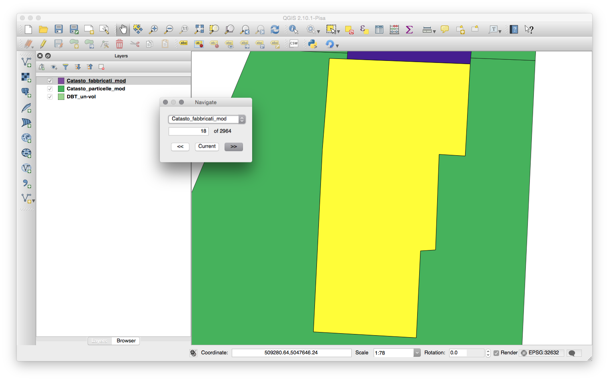
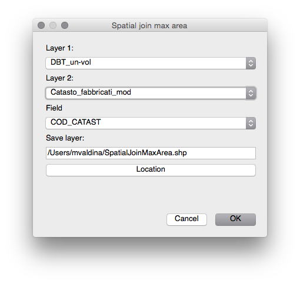

# User manual
#### Author note
 - *This work is based on real samples from Italy. So, nomenclature and specific data must be adapted to your country/scenario. This requires change to the gjko-plugin source code.*</br>
 - *This document provide a brief description without going deep in the terminology. You must read the PhD. Thesis __TITLE__ of Giulia Pasetti.*
 - *This work is an application of work of Giulia Pasetti PhD thesis.*

### User guide
This document describes how to use *Municipal Energy Model* plugin and how data must be formatted to be processed by *Municipal Energy Model* plugin.

*Municipal Energy Model* plugin is a QGIS plugin and it need to be installed like any other plugin in QGIS.

> The internal name of *Municipal Energy Model* plugin is *Gjko-plugin* sometime is referred with this name instead of *Municipal Energy Model* in the code.


### Installation
You can get latest version from the [release page](https://github.com/zanfire/qgis-utils/releases/tag) of GitHub repository.
To install this plugin you need to uncompress the downloaded file in the QGSI plugin folder. See documentation of your QGIS version about plugin installation. Anyway a common place of user plugin is `~/.qgis2/python/plugins` location.

After that you must open QGIS and enable *Municipal Energy Model* plugin in `Plugins` `->` `Manage and Install Plugins...`.


For more information about QGIS plugin read [http://docs.qgis.org/1.8/en/docs/user_manual/plugins/plugins.html](http://docs.qgis.org/1.8/en/docs/user_manual/plugins/plugins.html).

### Introduction
When you have successfully installed *Municipal Energy Model* plugin, you should see under the menu `Plugins` two additional options: `Municipal Energy Model` and `Municipal Energy Model - tool`. The first menu entry is the plugin itself with the main steps, the second menu entry is a set of tools developed as side utilities.

## Municipal Energy Model - Tool

The output of *Municipal Energy Model* plugin is a **Building** and **Volumes** layers.

The user need to go though each step to obtain the final layers. These steps are `1 - Assign ID_CAD`, `2 - Create energy layers` and `3 - Assign EPC and Typology`. 

### Step 1 - Assign ID_CAD


The first step is open through `Plugins` `->` `Municipal Energy Model` `->` `1 - Assign ID_CAD`. The inputs of this step are three layer, volumes layer, cadastre layer and cadastre terrain layer.
The ouptut of this step is a layer called **SpatialJoin** containing the **Volumes layer** plus the cadastre identification code from  **Cadastre layer** or **Cadastre terrain layer**.

 - **Volumes layer** must contain footprint of each building and each *feature* must have an attribute **UN\_VOL\_AV**[^2] that it provide height of each building/feature. This layer should also contain **USE** attribute.
 - **Cadastre layer** must contain the **COD_CATAST** attribute and each geometry must match as much as possible the volumes geometries. This layer will be  spatial joined with *volumes layer*.
 - **Cadastre terrain layer** must contain the **CHIAVE**[^2][^3] attribute. This layer is used in the case that for a *feature* in *volumes layer* doesn't have a cadastre identification code in *cadastre layer* is used the terrain cadastre identification code.

> Remark: **UN\_VOL\_AV** contain the height of described building. It is used in the follow step, so, if it is missing you will get an error in the following step.
> 
> Note: If a *feature* in *Volumes layer* covers multiple *feature* of *Cadastre layer* or *Cadastre terrain layer* it assigned the value from the *feature* that have the biggest common area.

### Step 2 - Create energy layers


This step creates **Volumes layer** and **Building layer**. **Volumes layer**
 contains the volume information of a building. For example: a build is composed by two volumes with different height. 
**Building layer** contains the sum of each volumes for the specific building. Each volumes are considered part of a building when touch another volume with the same cadastre identification code.

After this step you have these two layer that contains unfilled attribute that they will be filled in the next step.

### Step 3 - Assign EPC and Typology


This step fills **Volumes layer** and **Building layer** with the information provided by EPC and statistic data.

This step need additional information

- **ISTAT layer** is a layer containing the section and the ISTAT code **SEZ2011**. This identification code must be the same used in **ISTAT age CSV file**.
- **EPCs CSV file** is a CSV file containing energy efficency values from the Energy Performance Cetificate Database. Each field of CSV file must match the name used in the *Volumes layer* and *Building layer*.
- **Typology CSV file** is a CSV file containing for each typology the statistic data. This is used if EPC data are not available.
- **ISTAT age CSV file** is a CSV file that provide statistic **age** for a building in the ISTAT section.

During this step, it is associated to each building an age from ISTAT data. After that is computed the **ID_MEM**. When ID_MEM is generated we search of EPC certificate and if it is not available we use statistical data.

**ID_MEM** is an internal identification code formed by **USE-ID\_CAD\_volumeIndex**.

#### CSV file format ####
CSV file are text file where values are separated by comma. In *Municipal Energy Model* plugin the first row of each CSV file have a special meaning. The first row is used as header. 
In this way the plugin can look for specific field searching for the header name instead of position.

#### ISTAT age CSV file ####
This file contains the association from ISTAT identification code, called *SEZ2011* to the average age of this ISTAT section.

```
SEZ2011,SEZ_AGE
152060000001,1946-1960
152060000002,<=1945
152060000027,>=2006
```

 - **SEZ2011** is the ISTAT identification number provided in the **ISTAT layer**.
 - **SEZ_AGE** is a text field containing >=[year], <=[year] or [year]-[year].

#### Typology CSV file ####
This file contains for each typology the statistically data needed for the computation.

```
TYPOLOGY,wind_r,area_r,vol_r,h_level,U_env,U_roof,U_ground,U_wind,Eph,Eth,ETC,EFER,EPW,EPT,E_HEAT,E_DHW,E_H-DHW
E1-A-1,0.08,0.75,0.49,3.11,1.22,1.12,1.16,3.44,183.35,141.46,16.79,3.89,45.99,229.33,0.80,0.68,0.74
```

 - **TYPOLOGY** is an attribute computed by the *Municipal Energy Model* plugin that is composed by **USE\_AgeRange\_CompactnessRatioRange**.
 - **statistic data** other fields that will be read and imported in the **Building** and **Volumes** layer.

#### ID_EPC CSV file ####
This file contains for each EPC the energy efficiency data.

```
ID_EPC,Count of CODICE_IDENTIFICATIVO_PRATICA,SUP_NETTA|VOLUME_NETTO,AGE,wind_r,area_r,vol_r,h_level,U_env,U_roof,U_ground,U_wind,Eph,Eth,ETC,EFER,EPW,EPT,E_HEAT,E_DHW,E_H-DHW,PV_AREA,ST_AREA
E1-10-1234,6,515.36,1991-2005,0.131,0.851,0.747,2.59,0.70,0.74,0.83,3.05,131.34,75.02,18.09,0.00,60.44,191.78,0.58,0.38,0.52,0.00,0.00
```

 - **ID_EPC** is EPC identification code.
 - **statistic data** other fields that will be read and imported in the **Building** and **Volumes** layer.
 
## Municipal Energy Model - Tool

### Navigate through features...



This menu entry open a dialog that allow navigate through features of selected layer.

In the upper part of dialog you can choose the layer that you would navigate. In the central part is displayed the number of features and the current index. You can change the current index to navigate directly to a feature.
In the down part of dialog you can locate the forward button (<<), Current button and next button (>>).
The current button reset the focus on the current index in the case you moved the view on your layer.

> Remark: This dialog is topmost, this mean that will stay on top of QGIS window when lost focus.

### Spatial join max area



This menu entry open a dialog that allow a spatial join with a custom criteria. A field from **layer 2** is added to the **layer 1** and it saved in the provided location.

The particularity of this spatial join is that in case of a *feature* of *layer 1* cover two or more *features* of *layer 2* will be used the *feature* from *layer 2* that have biggest common area with *feature* of *layer 1*.

#### Definition ####
 * EPC: Energy Performance Certificates
 * MEM: Municipal Energy Model
 * ISTAT: Istituto Nazionale di Statistica - National Institute of Statistics (Italy)

#### Notes ####
<sup>1</sup>: This is the default name that it is suggested. You can change this name as you wish.</br>
<sup>2</sup>: Each attributes needed by Municipal Energy Model are defined in gjko-plugin/DEFINES.py file. You can locate your field and tune according your nomenclature.</br>
<sup>3</sup>: This is a BAD name ...</br>

:octocat:
