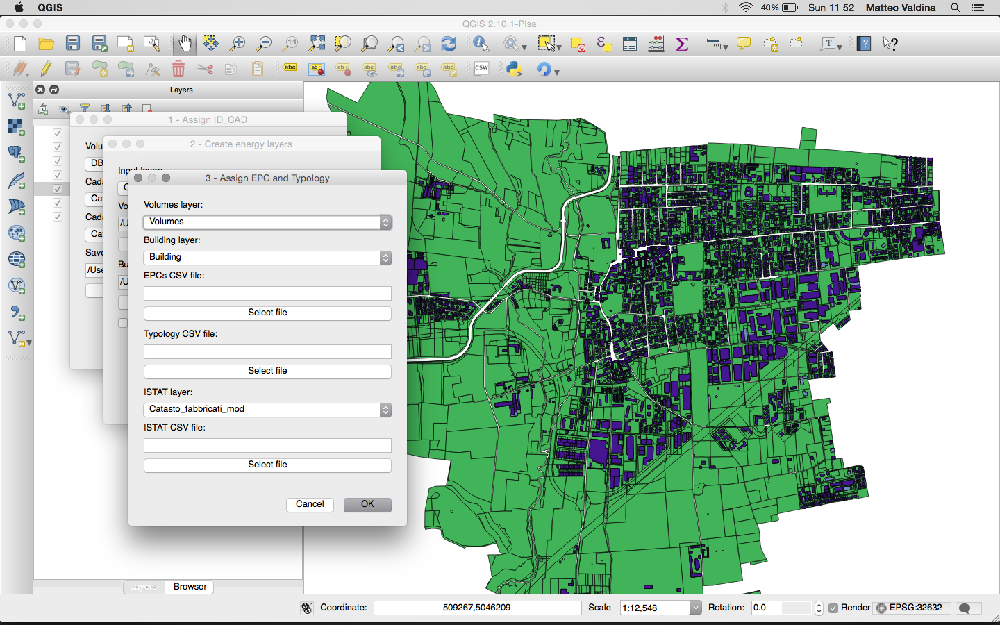
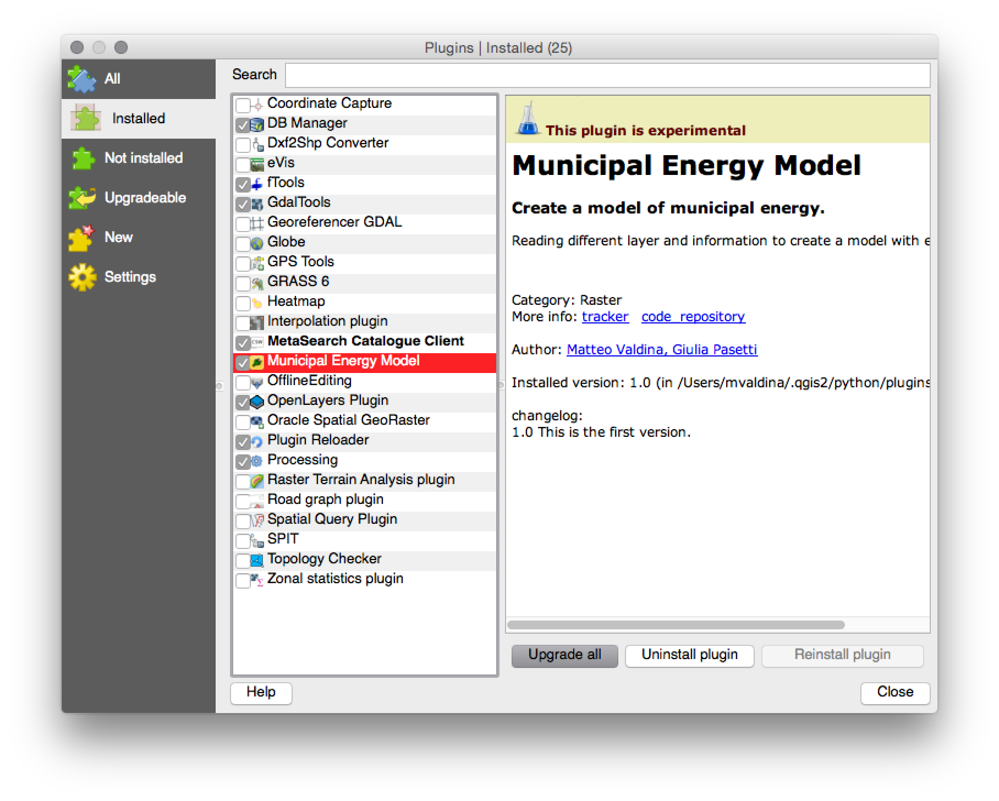
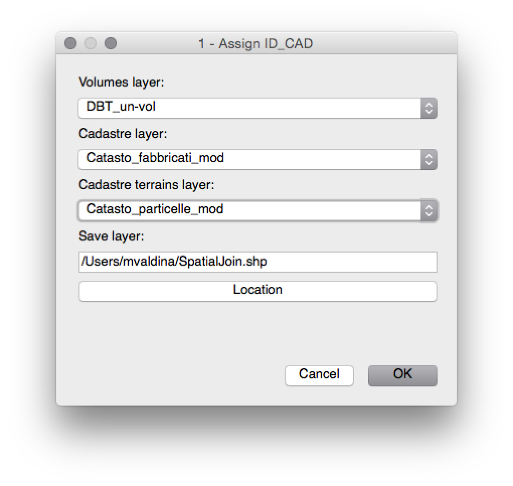
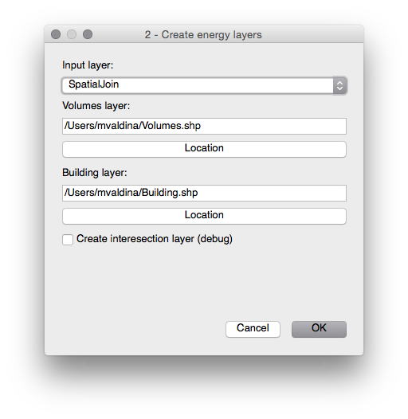
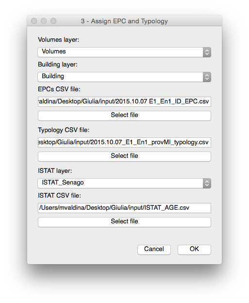

# User manual and data specifications
This document describes how to use *Municipal Energy Model* plugin (aka MEM plugin) and how data must be formatted to be processed by *Municipal Energy Model* plugin.

The internal name of *Municipal Energy Model* plugin is *Gjko-plugin* sometime is referred with this name instead of *Municipal Energy Model*.

*Municipal Energy Model* plugin is a QGIS plugin and it need to be installed like any other plugin in QGIS.

### Installation
You need grab the latest version from the [release page](https://github.com/zanfire/qgis-utils/releases/tag).
After that you need to unzip the content *gjko-plugin* folder in your QGIS plugin repository.
Common place for this folder could be `~/.qgis2/python/plugins`.

After that you must open QGIS and enable *Municipal Energy Model* plugin in `Plugnis -> Manage and Install Plugins...`

For more information read [http://docs.qgis.org/1.8/en/docs/user_manual/plugins/plugins.html](http://docs.qgis.org/1.8/en/docs/user_manual/plugins/plugins.html).

### Introduction
When you have sucessfully installed *Municipal Energy Model* plugin, you should see under the menu `Plugins` two additional options: `Municipal Energy Model` and `Municiapl Energy Model - tool`. The first option is the plugin itself with the main steps, the second option is a set of tools developed as side utility like checks and easy navigation through features.

The final result of *Municipal Energy Model* plugin is a layer called **Building** [^1]. During the processing is generated two additional layers called **SpatialJoin**[^1] and **Volumes**[^1].

In the follow paragraphers I'll describe each steps of *Municipal Energy Model* plugin.

### Step 1 - Assign ID_CAD

The first step is open through `Plugins -> Municipal Energy Model -> 1 - Assign ID_CAD`. The inputs of this step are three layer, volumes layer, cadastre layer and cadastre terrain layer.
The ouptut of this step is a layer called **SpatialJoin** containing the **Volumes layer** plus the cadastre identification code from  **Cadastre layer** or **Cadastre terrain layer**.

 - **Volumes layer** must contain footprint of each building and each *feature* must have an attribute **UN\_VOL\_AV**[^2] that it provide height of each building/feature.

 - **Cadastre layer** must contain the **COD_CATAST** attrbiute and each geometry must match as much as possible the volumes geometries. This layer will be  spatial joined with *volumes layer*.

 - **Cadastre terrain layer** must contain the **CHIAVE**[^2][^3] attribute. This layer is used in the case that for a *feature* in *volumes layer* doesn't have a cadastre identification code in *cadastre layer* is used the terrain cadastre identification code.

> Remark: **UN\_VOL\_AV** contain the heigh of described building. It is used in the follow step, so, if it is missing you will get an error in the follow step not this step.
> 
> Note: If a *feature* cover multiple *feature* of *Cadastre layer* or *Cadastre terrain layer* will be selected that have the biggest common area.

### Step 2 - Create energy layers

This step creates **Volumes layer** and **Building layer**. **Volumes layer**
 contains the volume information of a building. For example: a build is composed by two volumes with different height. 
**Building layer** contains the sum of each volumes for the specific building. Each volumes are considered part of a building when touch another volume with the same cadastre identification code.

After this step you have these two layer that contains unfilled attribute that they will be filled in the next step.

### Step 3 - Assign EPC and Typology

This step fills **Volumes layer** and **Building layer** with the information provided by EPC and statistic data.

This step need additional information: 

- **ISTAT layer** is a layer containing the section and the ISTAT code **SEZ2011**. This code is needed to match for each building over the an ISTAT section and provide the code. This code is used in the **ISTAT age CSV file**. 
- **EPCs CSV file** is a CSV file containing for each building the energy efficency values. Each field of CSV file must match the name used in the *Volumes layer* and *Building layer*.
- **Typology CSV file** is a CSV file containing for each topology the statistic data. This is used if EPC data are not available.
- **ISTAT age CSV file** is a CSV file that provide statistic **age** for a building in the ISTAT section.

[^1]: This is the default name that it is suggested. You can change this name as you wish.
[^2]: Each attributes needed by Municipal Energy Model are defined in gjko-plugin/DEFINES.py file. You can locate your field and tune according your nomenclature.
[^3]: This is a BAD name ...

:octocat:
