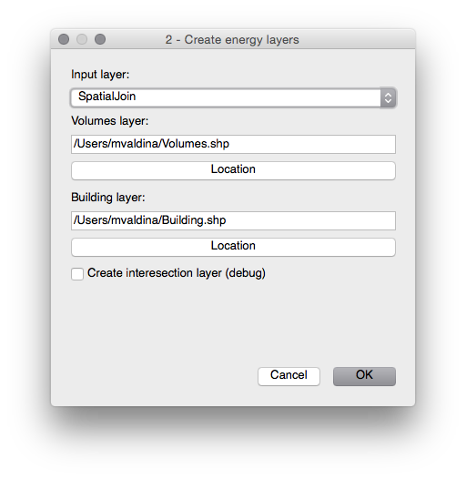

# User manual and specifications
This document describes how to use *Municipal Energy Model* plugin (aka MEM plugin) and how data must be formatted to be processed by *Municipal Energy Model* plugin.

The internal name of *Municipal Energy Model* plugin is *Gjko-plugin* sometimes is refferred with this name instad of *Municipal Energy Model*.

*Municipal Energy Model* plugin is a QGIS plugin and it need to be installed like any other plugin in QGIS

### Installation
You need grab the latest version from the [release page](https://github.com/zanfire/qgis-utils/releases/tag).
After that you need to unzip the content *gjko-plugin* folder in your QGIS plugin repository.
Common place for this folder could be `~/.qgis2/python/plugins`.

After that you must open QGIS and enable *Municipal Energy Model* plugin in `Plugnis -> Manage and Install Plugins...`

.

For more information read [http://docs.qgis.org/1.8/en/docs/user_manual/plugins/plugins.html](http://docs.qgis.org/1.8/en/docs/user_manual/plugins/plugins.html).

### Introduction
When you have sucessfully installed *Municipal Energy Model* plugin under the menu `Plugins` you must see two additional options: `Municipal Energy Model` and `Municiapl Energy Model - tool`. The first option is the plugin itself with the main steps, the second option is a set of tools developed as side utility like checks and easy navigation through features.

The final result of *Municipal Energy Model* plugin is a layer called **Building** [^1]. During the processing is generated two additional layers called **SpatialJoin**[^1] and **Volumes**[^1].

### Step 1 - Assign ID_CAD
The first step is open through `Plugins -> Municipal Energy Model -> 1 - Assign ID_CAD`. The inputs of this step are three layer, volumes layer, cadastre layer and cadastre terrain layer.
The ouptut of this step is a layer called **SpatialJoin** containing the **Volumes layer** plus the cadastre identification code from  **Cadastre layer** or **Cadastre terrain layer**.

 - **Volumes layer** must contain footprint of each building and each *feature* must have an attribute **UN\_VOL\_AV**[^2] that it provide height of each building/feature.

 - **Cadastre layer** must contain the **COD_CATAST** attrbiute and each geometry must match as much as possible the volumes geometries. This layer will be  spatial joined with *volumes layer*.

 - **Cadastre terrain layer** must contain the **CHIAVE**[^2][^3] attribute. This layer is used in the case that for a *feature* in *volumes layer* doesn't have a cadastre identification code in *cadastre layer* is used the terrain cadastre identification code.

> Remark: **UN\_VOL\_AV** contain the heigh of described building. It is used in the follow step, so, if it is missing you will get an error in the follow step not this one.

[^2]: Each attributes needed by Municipal Energy Model are defined in gjko-plugin/DEFINES.py file. You can locate your field and tune according your nomenclature.
[^3]: This is a BAD name ...

This step need the follow layers:
 - Volumes layer
 - Cadastre layer
 - Cadastre terrains layer

This step generate a layer called SpatialJoin containing Volumes layer fields
 plus COD_CATAST.

This step is domain specific spatial join that assign for each volume in 
 volumes layer the right cadastre identification code.

### Volumes layer requirements

## Step 2 - Create energy layers

This step require the spatial join layer created in the previous step.

This step create two separate layer

# Developer note
[^1]: This is the default name that it is suggested. You can change this name as you wish.

:octocat: