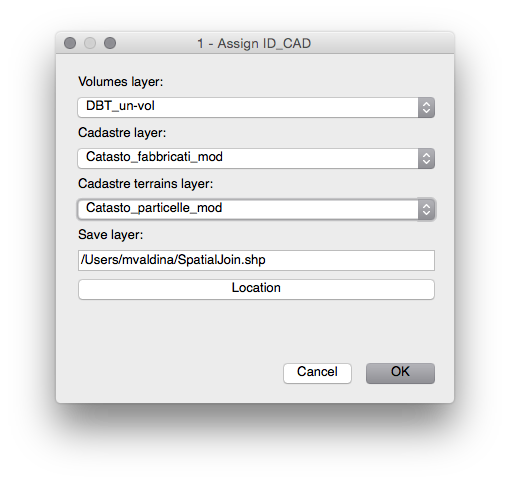

# User manual and specifications
This document describes how to use *Municipal Energy Model* plugin (aka MEM plugin) and how data must be formatted to be processed by *Municipal Energy Model* plugin.

The internal name of *Municipal Energy Model* plugin is *Gjko-plugin* sometimes is refferred with this name instad of *Municipal Energy Model*.

## Overview
*Municipal Energy Model* plugin is a QGIS plugin and it need to be installed like any other plugin in QGIS

### Installation
You need grab the latest version from the [release page](https://github.com/zanfire/qgis-utils/releases/tag).
After that you need to unzip the content *gjko-plugin* folder in your QGIS plugin repository.
Common place for this folder could be `~/.qgis2/python/plugins`.

After that you must open QGIS and enable *Municipal Energy Model* plugin in `Plugnis -> Manage and Install Plugins...`

.

For more information read [http://docs.qgis.org/1.8/en/docs/user_manual/plugins/plugins.html](http://docs.qgis.org/1.8/en/docs/user_manual/plugins/plugins.html).

### Introduction
When you have sucessfully installed *Municipal Energy Model* plugin under the menu `Plugins` you must see two additional options: `Municipal Energy Model` and `Municiapl Energy Model - tool`. The first option is the plugin itself with the main steps, the second option is a set of tools developed as side utility like checks and easy navigation through features.

The final result of *Municipal Energy Model* plugin is a layer called **Buildning** [^1]. 

[^1]: This is the default name, you can change this name but in the document will be reffered as Building layer.

## Step 1 - Assign ID_CAD

This step need the follow layers:
 - Volumes layer
 - Cadastre layer
 - Cadastre terrains layer

This step generate a layer called SpatialJoin containing Volumes layer fields
 plus COD_CATAST.

This step is domain specific spatial join that assign for each volume in 
 volumes layer the right cadastre identification code.

### Volumes layer requirements

## Step 2 - Create energy layers

This step require the spatial join layer created in the previous step.

This step create two separate layer

## Data specification
